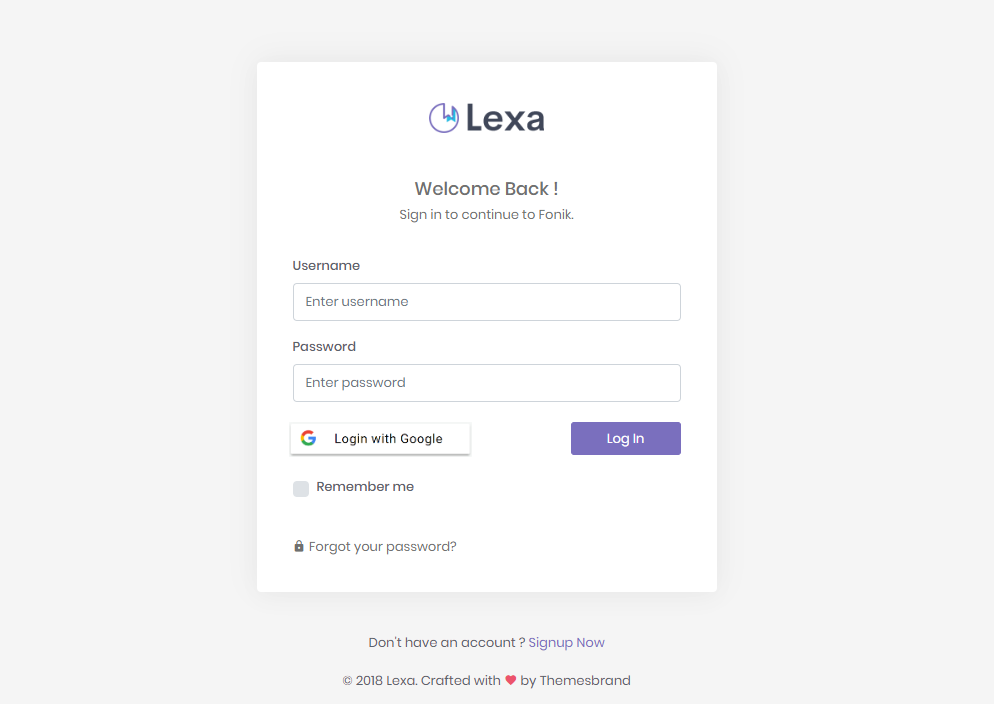

# passport-google-oauth20 and passport-local with mysql

[Passport](http://passportjs.org/) strategy for authenticating with [Google](http://www.google.com/)
using the OAuth 2.0 API and passport-local strategy.
<div style="font-size:12px">
  <p align="center"></p>
</div>
This module lets you authenticate using Google and general authentication mode(matching user with existed users on your mysql database ) in your Node.js applications.
It is using html 5 theme login page to demonstrate the passport strategy.
By plugging into Passport, Google authentication and passport-local can be easily and
unobtrusively integrated into any application or framework that supports
[Connect](http://www.senchalabs.org/connect/)-style middleware, including
[Express](http://expressjs.com/).

[](https://www.npmjs.com/package/passport-google-oauth20)
[](https://travis-ci.org/jaredhanson/passport-google-oauth2)
[](https://coveralls.io/github/jaredhanson/passport-google-oauth2)
[...](https://github.com/jaredhanson/passport-google-oauth2/wiki/Status)

## Install

```bash
$ npm install passport-google-oauth20
$ npm install passport-local
```

## Usage

#### Create an Application

Before using `passport-google-oauth20`, you must register an application with
Google.  And If you want to use `passport-local`, you must register the user on your mysql database.
If you have not already done so regarding the `passport-google-oauth20`, a new project can be created in the
[Google Developers Console](https://console.developers.google.com/).
Your application will be issued a client ID and client secret, which need to be
provided to the strategy.  You will also need to configure a redirect URI which
matches the route in your application.

#### Configure Strategy

The Google authentication strategy authenticates users using a Google account
and OAuth 2.0 tokens.  The client ID and secret obtained when creating an
application are supplied as options when creating the strategy.  The strategy
also requires a `verify` callback, which receives the access token and optional
refresh token, as well as `profile`, `email` which contains the authenticated user's
Google profile.  The `verify` callback must call `cb` providing a user to
complete authentication.

```javascript
var GoogleStrategy = require('passport-google-oauth20').Strategy;
var LocalStrategy = require('passport-local').Strategy

passport.use(new GoogleStrategy({
    clientID: GOOGLE_CLIENT_ID,
    clientSecret: GOOGLE_CLIENT_SECRET,
    callbackURL: "http://www.example.com/auth/google/callback"
  },
  function(accessToken, refreshToken, profile, cb) {
    User.findOrCreate({ googleId: profile.id }, function (err, user) {
      return cb(err, user);
    });
  }
));

passport.use(
    new LocalStrategy({ usernameField: 'name' }, (name, password, done) => {
      // Match user
        connection.query("SELECT * from " + mysql_conf.USERTABLE + " where name='" + name  + "'", function(err, rows, fields) {
            if (!err){
                const user = rows[0];
                if(user.password == password) {
                    return done(null, user);
                } else {
                    console.log("password incorrect");
                    return done(null, false, { message: 'Password incorrect' });
                }

            }
            else{
                console.log('Error while performing Query.');
                return done(null, false, { message: 'That email is not registered' });
            }
        });
    })
  );
```

#### Authenticate Requests

Use `passport.authenticate()`, specifying the `'google'` strategy, to
authenticate requests.
Or you can authenticate reuqests by using `passport.authenticate()` regarding `'passport-local'`
For example, as route middleware in an [Express](http://expressjs.com/)
application:

```javascript
app.get('/auth/google',
  passport.authenticate('google', { scope: ['profile'] }));

app.get('/auth/google/callback', 
  passport.authenticate('google', { failureRedirect: '/login' }),
  function(req, res) {
    // Successful authentication, redirect home.
    res.redirect('/');
  });
  ```
#### Run this app
```bash
$ node app.js 
or
$ npm install nodemon
$ nodemon index
```
## Examples

Developers using the popular [Express](http://expressjs.com/) web framework can
refer to an [example](https://github.com/passport/express-4.x-facebook-example)
as a starting point for their own web applications.  The example shows how to
authenticate users using Facebook.  However, because both Facebook and Google
use OAuth 2.0, the code is similar.  Simply replace references to Facebook with
corresponding references to Google.


## License

[The MIT License](http://opensource.org/licenses/MIT)
